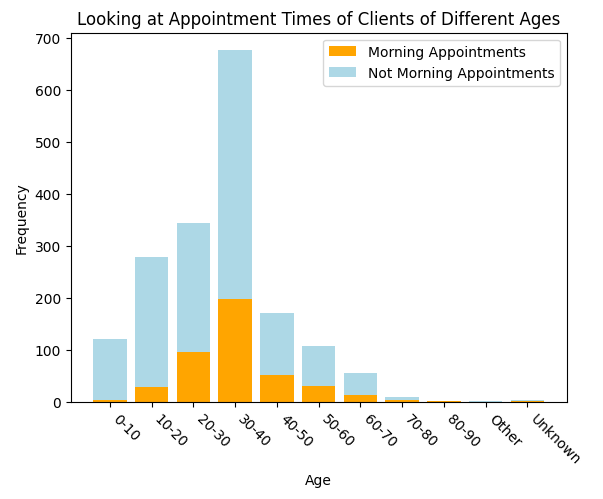
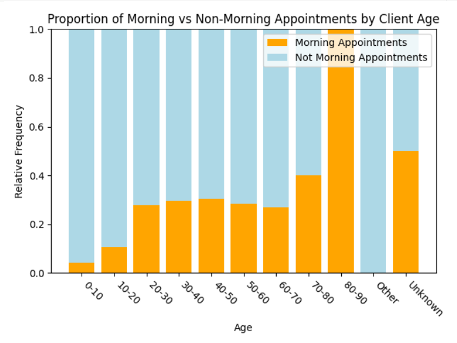
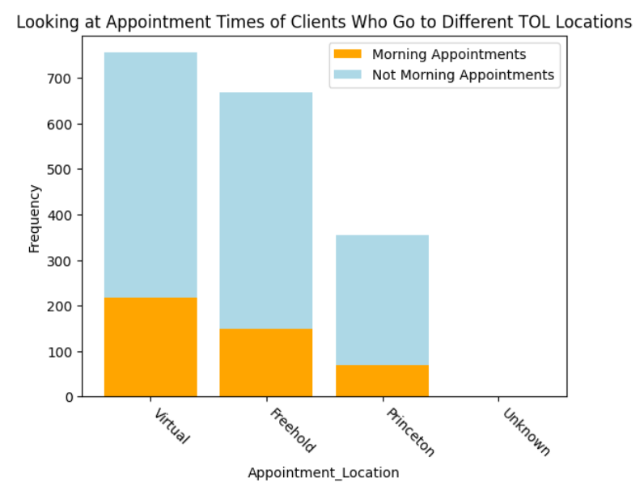
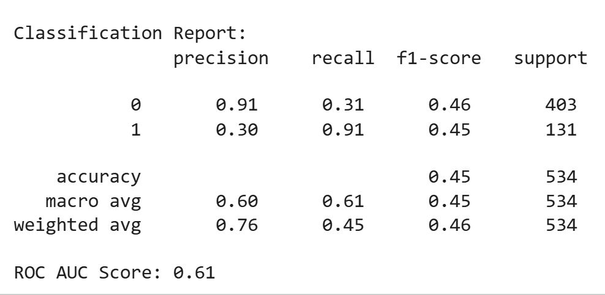
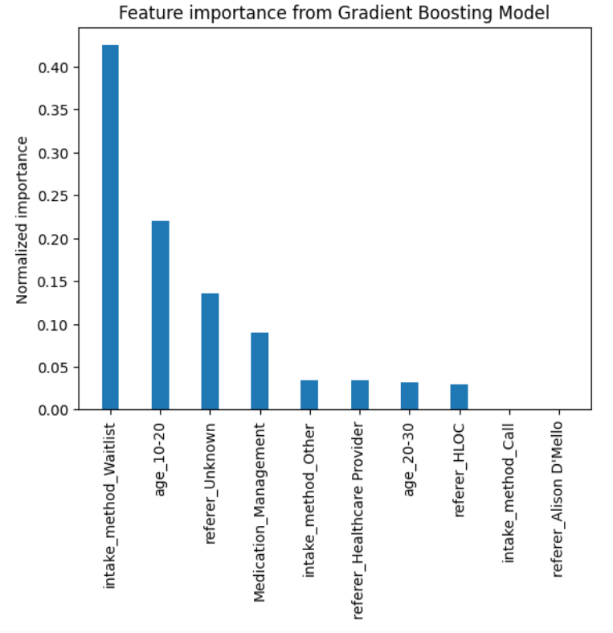

# Mental-Health-Matters-Improving-Access-to-Resources

---

### 👥 **Team Members**

**Example:**

| Name               | GitHub Handle | Contribution                                                                      |
|--------------------|---------------|-----------------------------------------------------------------------------------|
| Anika Razzak       | @anikarazz    | Data exploration and standardization, Random Forest model building and training   |
| Ariana Yahia       | @ArianaY123   | Data collection, exploratory data analysis (EDA), dataset documentation           |
| Chinny Igwuilo     | @             | Data preprocessing, feature engineering, data validation                          |
| Fnu Pankhuri       | @Rose-Petals  | Model selection, hyperparameter tuning, model training and optimization           |
| Mofe Sam-Adelusimo | @mofex99      | Model evaluation, performance analysis, results interpretation                    |
| Shreena Thakker    | @shreenat     | Model evaluation, performance analysis, results interpretation                    |

| Name             | GitHub Handle | Contribution                                                                                    |
|------------------|---------------|-------------------------------------------------------------------------------------------------|
| Shreena Thakker  | @shreenat     | Data Cleaning, Statistical Analysis, Decision Tree Model Tuning, Gradient Descent Model         |
|                  |               |                                                                                                 |
|                  |               |                                                                                                 |
|                  |               |                                                                                                 |
|                  |               |                                                                                                 |

---

## 🎯 **Project Highlights**

**Example:**

- Developed a machine learning model using `[model type/technique]` to address `[challenge project task]`.
- Achieved `[key metric or result]`, demonstrating `[value or impact]` for `[host company]`.
- Generated actionable insights to inform business decisions at `[host company or stakeholders]`.
- Implemented `[specific methodology]` to address industry constraints or expectations.

---

## 👩🏽‍💻 **Setup and Installation**

**Provide step-by-step instructions so someone else can run your code and reproduce your results. Depending on your setup, include:**

* How to clone the repository
* How to install dependencies
* How to set up the environment
* How to access the dataset(s)
* How to run the notebook or scripts

---

## 🏗️ **Project Overview**

**Describe:**

- How this project is connected to the Break Through Tech AI Program
- Your AI Studio host company and the project objective and scope
- The real-world significance of the problem and the potential impact of your work

---

## 📊 **Data Exploration**

**You might consider describing the following (as applicable):**

* The dataset(s) used: origin, format, size, type of data
* Data exploration and preprocessing approaches
* Insights from your Exploratory Data Analysis (EDA)
* Challenges and assumptions when working with the dataset(s)

**Data Cleaning Steps**
- Created uniform and easy to understand column names for the columns
- Replaced missing values with 'Unknown' category
- Performed One-Hot-Encoding for all categorical feature columns except the target variable
- Merged 3 different datasets into one
- Removed the columns that weren't common among the 3 datasets or that didn't contribute much to the prediction

**Statistical Analysis**
- We performed Chi-Squared Statistical Test between each feature variable and the target variable (appointment_time). 
- Using a significance level of 0.05 we determined the variables that were most associated with the client appointment time.
- The most associated variables are: 'intake_method', 'age', 'Medication_Management', 'Talk_Therapy'
- 'Medication_Management' and 'Talk_Therapy' are appointment types

**Visualizations:**
- Visualized the effects of the above variables on client appointment times
- Some of the most significant observations:

- Majority of morning patients are of age 30-40

 

- 100% of the 80-90 age group were morning clients
- Although this included only 3 people, this observation can be further tested

 

- Majority of the morning appointements were virtual

 

- A higher proportion of clients coming in for Medication Managment choose morning appointments

 
---

## 🧠 **Model Development**
We built 4 different ML models to predict whether a new client at Tree Of Life would choose a morning appointment or not.

### 1. Logistic Regression
### 2. Decision Tree
### 3. Gradient Boosting

Gradient Boosting is an ensemble learning method that builds a sequence of models, where each subsequent model focuses on correcting the errors of the previous ones.

#### Objective
The goal of this model is to predict whether a patient prefers a **morning appointment** or **not**.

#### Model Choice
We used the **XGBoost** implementation of Gradient Boosting. This allowed us to assign greater weight to patients who prefer morning appointments in order to compensate for class imbalance in the target variable.

#### Pros and Cons
**Pros**
- Performs well on non-linear relationships
- Captures complex feature interactions effectively

**Cons**
- Prone to overfitting if not carefully tuned

#### Results

- The Gradient Boosting model achieved very high **Recall** suggesting that most of the morning appointments are predicted as morning by the model.
- However, the low **Precision** indicates that many non-morning appointments are also labelled as morning.

#### Feature Importance
Feature importance analysis shows which input variables contributed most to the model’s predictions, providing interpretability into the factors influencing appointment time preference.

### 4. Random Forest

**You might consider describing the following (as applicable):**

* Model(s) used (e.g., CNN with transfer learning, regression models)
* Feature selection and Hyperparameter tuning strategies
* Training setup (e.g., % of data for training/validation, evaluation metric, baseline performance)

---

## 📈 **Results & Key Findings**

**You might consider describing the following (as applicable):**

* Performance metrics (e.g., Accuracy, F1 score, RMSE)
* How your model performed
* Insights from evaluating model fairness

**Potential visualizations to include:**

* Confusion matrix, precision-recall curve, feature importance plot, prediction distribution, outputs from fairness or explainability tools

---

## 🚀 **Next Steps**

**You might consider addressing the following (as applicable):**

* What are some of the limitations of your model?
* What would you do differently with more time/resources?
* What additional datasets or techniques would you explore?

---

## 📝 **License**

If applicable, indicate how your project can be used by others by specifying and linking to an open source license type (e.g., MIT, Apache 2.0). Make sure your Challenge Advisor approves of the selected license type.

**Example:**
This project is licensed under the MIT License.

---

## 📄 **References** (Optional but encouraged)

Cite relevant papers, articles, or resources that supported your project.

---

## 🙏 **Acknowledgements** (Optional but encouraged)

Thank your Challenge Advisor, host company representatives, TA, and others who supported your project.
