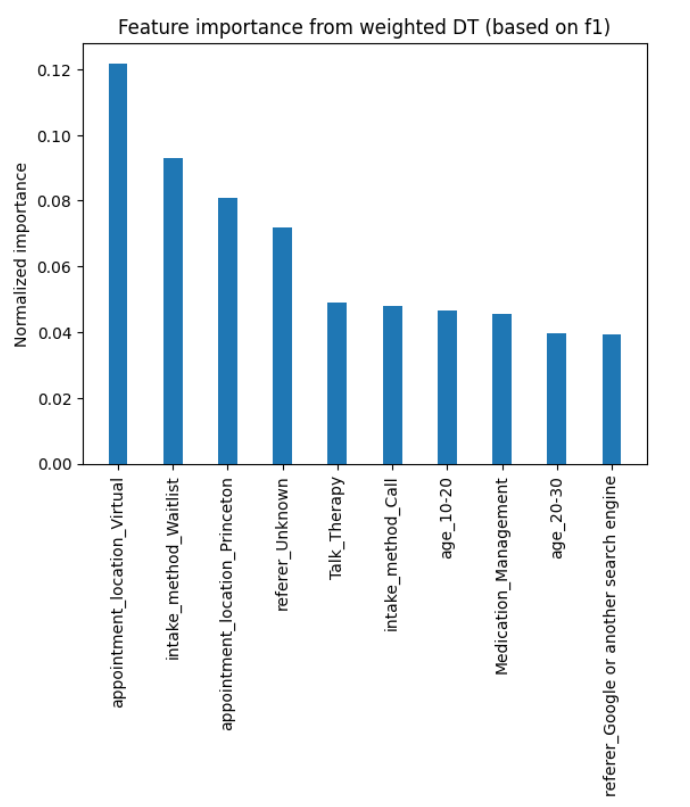

# Mental-Health-Matters-Improving-Access-to-Resources

---

### 👥 **Team Members**

**Example:**

| Name               | GitHub Handle | Contribution                                                                             |
|--------------------|---------------|------------------------------------------------------------------------------------------|
| Anika Razzak       | @anikarazz    | Data exploration and standardization, Random Forest model building and training          |
| Ariana Yahia       | @ArianaY123   | Data Cleaning, Statistical Analysis, Building and Tuning Decision Tree Model             |
| Chinny Igwuilo     | @             |                                                                                          |
| Fnu Pankhuri       | @Rose-Petals  | Data Cleaning and exploration, Logistic Regression, Project Management                   |
| Mofe Sam-Adelusimo | @mofex99      |                                                                                          |
| Shreena Thakker    | @shreenat     | Data Cleaning, Statistical Analysis, Decision Tree Model Tuning, Gradient Descent Model  |

---
## 🎯 **Project Highlights**

- Developed Logistic Regression, Random Forest Tree, Gradient Boost, and Decision Tree machine learning models to address demographic of patients most likely to take morning appointments.
- Compared models using F1 scores, accuracy, recall, precision, and accuracy.
- Generated demographics for Tree of Life Counseling to target for their morning appoitnments.

---

## 👩🏽‍💻 **Setup and Installation**
Environment Used: 
* All of our coding was done in either Jupyter Notebooks or Google Colab
* So all script files have the .ipynb extension
* The datasets are all CSV files and can be opened in Microsoft Excel or Google Sheets

'datasets' Directory:
* Contains the all 3 datasets given to us by Tree of Life(TOL)
  * TOLCC Break Through Tech Dataset_1.csv
  * TOLCC Break Through Tech Dataset_2.csv
  * TOLCC Break Through Tech Dataset_3.csv
* Scripts for cleaning the data
  * Tree_of_Life_Project_Team_B_dataset1_clean.ipynb
  * Tree_of_Life_Project_Team_B_dataset2_clean.ipynb
  * Tree_of_Life_Project_Team_B_dataset3_clean.ipynb
* The cleaned datasets
  * TOL_dataset1_cleaned.csv
  * TOL_dataset2_cleaned.csv
  * TOL_dataset3_cleaned.csv
* The script to combine the cleaned datasets
  * Combine.ipynb
* The combined dataset
  * combined_df.csv

'models' Directory
* This directory contains the scripts for building, tuning, and evaluating each model
* They all use the combined_df.csv which has to be uploaded to the Google Colab or Jupyter Notebooks before running.
* Follow along the documentation in the to understand what each step is doing.

Statistical Tests.ipynb
* This scripts runs Chi-Squared statistical tests on the data
* It is also creates useful visuals for exploratory data analyis
* Upload the combined_df.csv script to the Google Colab or Jupyter Notebook before running the script

---

## 🏗️ **Project Overview**

- Our project is connected to Break Through Tech by their 2025 ML Learning Program. Over the span of three months we applied what we learned in the Machine Leading Modules and made multiple Machine Leaning Models
- Our AI Host Company is Tree of Life Counseling who needed help filling up their morning appoitment slots.
- We were given patient data that we used to make predictive models based on previous patient patterns for apointment slots.

---

## 📊 **Data Exploration**

**Data Cleaning Steps**
- Created uniform and easy to understand column names for the columns
- Replaced missing values with 'Unknown' category
- Performed One-Hot-Encoding for all categorical feature columns except the target variable
- Merged 3 different datasets into one
- Removed the columns that weren't common among the 3 datasets or that didn't contribute much to the prediction

**Statistical Analysis**
- We performed Chi-Squared Statistical Test between each feature variable and the target variable (appointment_time). 
- Using a significance level of 0.05 we determined the variables that were most associated with the client appointment time.
- The most associated variables are: 'intake_method', 'age', 'Medication_Management', 'Talk_Therapy'
- 'Medication_Management' and 'Talk_Therapy' are appointment types

**Visualizations:**
- Visualized the effects of the above variables on client appointment times
- Some of the most significant observations:

- Majority of morning patients are of age 30-40

 

- 100% of the 80-90 age group were morning clients
- Although this included only 3 people, this observation can be further tested

 

- Majority of the morning appointements were virtual

 

- A higher proportion of clients coming in for Medication Managment choose morning appointments

 
---

## 🧠 **Model Development**
We built 4 different ML models to predict whether a new client at Tree Of Life would choose a morning appointment or not.

### Objective
The goal of these models is to predict is a client will take a **morning appointment** or **not**.

### 1. Logistic Regression
### 2. Decision Tree
Decision Tree is a model that splits data into smaller groups based on client features 
#### Pros and Cons
**Pros**
- Can capture complex patterns in data

**Cons**
- Prone to overfitting (memorizing the training data)

#### Results
- **Precision** : 0.33
- **Recall** : 0.53
- **F1 Score** : 0.41
- **Accuracy** : 0.62

- The 0.53 recall value means that the around 53% of the morning appointments will be predicted corectly.
- The accuracy value shows that 62% of the predictions made by the model were correct.
- The low values are due to class imbalance 

#### Feature Importance

The features that influenced the predictions the most are: 
- Virtual appointments
- Waitlist intake

### 3. Gradient Boosting

Gradient Boosting is an ensemble learning method that builds a sequence of models, where each subsequent model focuses on correcting the errors of the previous ones.

#### Model Choice
We used the **XGBoost** implementation of Gradient Boosting. This allowed us to assign greater weight to patients who prefer morning appointments in order to compensate for class imbalance in the target variable.

#### Pros and Cons
**Pros**
- Performs well on non-linear relationships
- Captures complex feature interactions effectively

**Cons**
- Prone to overfitting (memorizing training data) if not carefully tuned 

#### Results
- **Precision** : 0.30
- **Recall** : 0.91
- **F1 Score** : 0.45
- **Accuracy** : 0.45

- The Gradient Boosting model achieved very high **Recall** suggesting that most of the morning appointments are predicted as morning by the model.
- However, the low **Precision** indicates that many non-morning appointments are also labelled as morning.

#### Feature Importance
Feature importance analysis shows which input variables contributed most to the model’s predictions, providing interpretability into the factors influencing appointment time preference.

The features that influenced the predictions the most are: 
- Most influential variables:
- Clients from waitlist
- Age 10 - 20
However according to the statitical analysis, these contribute by predicting clients that do not prefer morning appointments.

### 4. Random Forest
A Random Forest multi-class classification model was used to predict appointment time
(Morning, Afternoon, Evening) based on client demographic and intake-related features.
Random Forest was selected for its ability to handle categorical data and provide
interpretable feature importance.

#### Features
The model was trained using the following predictors:
- Intake method
- Referral source
- Age group
- Appointment location

All features were one-hot encoded. The target variable was `appointment_time`.

#### Training & Evaluation
- Train/Test Split: 80% / 20%
- Model: Random Forest (300 trees, class-weighted)
- Evaluation Metrics: Accuracy, Precision, Recall, F1-score

#### Results (after class balance):
- Overall accuracy: ~47% (above random baseline of ~33%)
- Morning F1-score: ~0.37

---

## 📈 **Results & Key Findings**

We evaluated our classification models using:
- **Accuracy** (overall correctness)
- **Precision / Recall / F1-score** (to balance false positives vs. false negatives)

**Best-performing model:** **Gradient Boosting**  
(chosen due to highest recall and F1-score in an imbalanced dataset)

**Key results:**
- Accuracy: **0.45**
- F1-score: **0.45**
- Precision: **0.30**
- Recall: **0.91**

Overall, the models helped compare both predictive performance and feature importance. While Logistic Regression performed well on accuracy, it struggled with recall due to class imbalance. Tree-based models (Decision Tree, Random Forest, Gradient Boosting) better captured non-linear relationships and produced more actionable insights.

## Key Findings (Feature / Variable Importance)
Across models, the strongest signals included:
- **Referral sources:** Friends/Family and Healthcare Provider (Random Forest)
- **Waitlist status:** Clients from waitlist and waitlist intake (Gradient Boosting, Decision Tree)
- **Appointment type:** Virtual appointments (Decision Tree)
- **Age groups:** 10–20 (and 80–90 in demographic analysis)
- **Other signals:** Referred Private Practice Therapist (Logistic Regression)
- **Service/need:** Medication Management
- **Location/type:** Freehold and Virtual appointments

These findings directly supported the client’s goal of identifying **top referral sources and key demographics** for targeted outreach and marketing.

## Fairness / Bias Checks
We reviewed model behavior across key subgroups:
- **Age ranges**
- **Appointment type (virtual vs. in-person)**
- **Referral source**

Performance varied across age groups, with younger clients (10–20) showing stronger influence in predictions. Features related to waitlist status and virtual appointments were highly weighted, indicating potential access-related bias. These results highlight the importance of monitoring subgroup-level performance and using high-recall models carefully in practice.

---

## 🔥 **Challenges**
1. **Class Imbalance** : 75% of the data consisted of non-morning patients while 25% of the data consisted of morning clients. This made it difficult for the model to learn patterns among the morning clients.
2. **Combining Datasets** : We had 3 separate datasets with slightly different features, columns names, and data types. This made merging them a bit difficult. We also lost a lot of columns (unique to a particular dataset) due to merging. 
3. **Establishing Team Meetings** : Since our team members all come from different colleges and time zones, it was a challenge to schedule meetings and collaborate effectively.

---

## 🚀 **Next Steps**

To address these issues, future work would focus on:
- Collecting more balanced data across demographics, referral sources, and appointment locations
- Expanding location-based features (city, zip code, distance, access to virtual care)
- Continuing to monitor subgroup-level performance to reduce bias

### Naive Bayes Model
As a next step, we would implement a **Naive Bayes model** as a lightweight baseline. Because the dataset contains many categorical variables, Naive Bayes could provide faster training and clearer probabilistic insights, allowing us to compare recall and interpretability against existing models.

### Predicting an Optimal 3rd TOL Location
The client is considering opening a **third TOL location**, and future analysis would focus on using **demographic and referral data** to support this decision. By training models on location-specific client features, we could:
- Identify geographic areas with high demand for services
- Analyze which demographics and referral sources are most active by location
- Predict appointment uptake and service preferences in new regions

Using these insights, we would simulate potential locations and evaluate which areas show the strongest predicted engagement, helping the client make a **data-driven decision** on where to open a third location.

### Future Direction
With expanded demographic and geographic data, models could be retrained and validated to ensure insights remain accurate and actionable. This approach would allow the client to scale operations while targeting communities with the greatest projected impact.

---

## 🙏 **Acknowledgements** (Optional but encouraged)

Thank your Challenge Advisor, host company representatives, TA, and others who supported your project.
